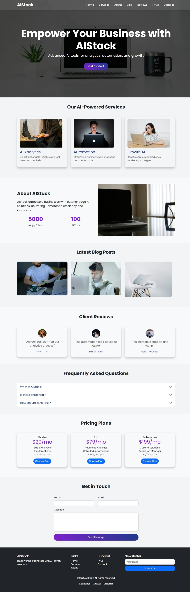
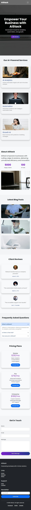

# AIStack SaaS Landing Page

## Overview
AIStack is an ultra-modern, responsive landing page for a SaaS platform offering AI-powered tools for analytics, automation, and growth. Built with **HTML, CSS, Bootstrap 5, JavaScript, and jQuery**, it features a sleek glassmorphism design, advanced animations, and a user-friendly interface. This project demonstrates my expertise in creating pixel-perfect, interactive websites for clients on Fiverr.

## Features
- **Responsive Design**: Seamlessly adapts to desktop and mobile devices (320px-1200px+).
- **Advanced Interactivity**: jQuery-powered parallax scrolling, review slider, FAQ accordion, and stats counter.
- **Modern UI/UX**: Glassmorphism cards, blue-purple gradient scheme, and Poppins font.
- **Sections**: Header, Hero, Services, About, Blog, Client Reviews, FAQs, Pricing, Contact, Footer.
- **Performance**: Lazy loading for images, optimized animations for mobile.
- **Animations**: Flip cards (blog), hover effects, and micro-interactions.
- **Bug-Free**: Clean, SEO-friendly code with cross-browser compatibility.

## Technologies Used
- **HTML5**: Semantic structure.
- **CSS3**: Custom styling with glassmorphism and Bootstrap 5 for responsive grids.
- **JavaScript/jQuery**: Dynamic animations and interactivity.
- **Bootstrap 5**: Responsive layout and components.
- **Unsplash**: Royalty-free images.

## Setup Instructions
1. **Clone the Repository**:
   ```bash
   git clone https://github.com/muzamal478/aistack-landing-page.git
   ```
2. **Navigate to Folder**:
   ```bash
   cd aistack-landing-page
   ```
3. **Open Locally**:
   - Open `index.html` in a browser (e.g., Chrome).
   - Or use a local server (e.g., VS Code Live Server).

## Deployment
The website is live on GitHub Pages: [View Live Demo](https://muzamal478.github.io/aistack-landing-page/)

## Project Structure
```
aistack-landing-page/
├── index.html
├── css/
│   └── style.css
├── js/
│   └── script.js
├── images/
│   ├── hero-bg.jpg
│   ├── service1.jpg
│   ├── service2.jpg
│   ├── service3.jpg
│   ├── about-bg.jpg
│   ├── blog1.jpg
│   ├── blog2.jpg
│   ├── blog3.jpg
│   ├── review1.jpg
│   ├── review2.jpg
│   └── review3.jpg
├── README.md
└── LICENSE
```

## Screenshots
**Desktop View**  


**Mobile View**  


## Credits
- **Images**: Royalty-free from [Unsplash](https://unsplash.com/).
- **Fonts**: Poppins via Google Fonts.
- **Developer**: Muzamal Asghar ([GitHub](https://github.com/muzamal478)).

## License
This project is licensed under the MIT License - see the [LICENSE](LICENSE) file for details.

## Contact
For inquiries, reach out via [Fiverr](https://www.fiverr.com/muzamilcreator) or [GitHub](https://github.com/muzamal478).
